<div align="center">

# 🚗💥 Car Crash Detection System

**An Android + ESP32 + MQTT emergency-response platform that detects a vehicle crash and coordinates help between the victim and emergency responders.**

*Final project — PNT Internship*


</div>

---

## 1. What it is

The Car Crash Detection System is a two-role mobile platform built around a simple idea: when a car
crashes, the people who can help should know **immediately**, **where** it happened, and **who** is
involved — including the victim's critical medical information.

It has three cooperating parts:

1. **An ESP32 sensor node** mounted in the vehicle. It reads an MPU6050 accelerometer and a GPS
   module and streams live motion + location data over **Bluetooth Low Energy (BLE)**.
2. **The Android app**, which runs in one of two roles:
   - **Publisher** (the in-vehicle / victim device) — receives sensor data, detects a crash,
     attaches the victim's GPS location and medical profile, and broadcasts an emergency alert.
   - **Subscriber** (the emergency responder device) — receives alerts in real time, views the
     incident and the victim's medical profile, and sends back an acknowledgement with an ETA.
3. **An MQTT broker** (Mosquitto) on the local network that relays messages between Publisher and
   Subscriber devices.

> This project was built as the **final deliverable of a PNT internship**. It is an academic /
> demonstration system, not a certified safety device — see [Status & limitations](#9-status--limitations).

---

## 2. How it works (end to end)

```mermaid
flowchart LR
    subgraph Vehicle["🚗 Vehicle"]
        MPU[MPU6050<br/>accelerometer]
        GPSMOD[GPS module]
        ESP[ESP32<br/>BLE server]
        MPU -- I2C --> ESP
        GPSMOD -- UART --> ESP
    end

    subgraph Publisher["📱 Publisher (victim phone)"]
        BT[Esp32BluetoothService]
        CRASH[Crash detection<br/>+ severity]
        PROFILE[Medical profile<br/>+ GPS]
        PUB[MqttService]
        BT --> CRASH --> PROFILE --> PUB
    end

    BROKER{{"📡 Mosquitto<br/>MQTT broker"}}

    subgraph Subscriber["📱 Subscriber (responder phone)"]
        SUB[MqttService]
        UI[Alert history /<br/>incident detail]
        ACK[Response + ETA]
        SUB --> UI --> ACK
    end

    ESP -- "BLE notify<br/>ACC|IMPACT|GPS" --> BT
    PUB -- "publish<br/>emergency/alerts/{id}" --> BROKER
    BROKER -- "deliver alert" --> SUB
    ACK -- "publish<br/>emergency/response/{id}" --> BROKER
    BROKER -- "deliver ack" --> PUB
```



**The lifecycle of one incident:**

| # | Stage | What happens |
|---|-------|--------------|
| 1 | **Sense** | ESP32 reads acceleration (g) + GPS and `notify()`s a string every 100 ms over BLE. |
| 2 | **Detect** | The Publisher app parses the stream and applies an impact threshold to decide a crash occurred, then classifies severity (LOW/MEDIUM/HIGH/CRITICAL). |
| 3 | **Enrich** | It attaches the victim's last known GPS position and their stored medical profile (blood type, allergies, medications, conditions). |
| 4 | **Alert** | It publishes an `EmergencyAlertMessage` to `emergency/alerts/{incidentId}` via MQTT (QoS 1). |
| 5 | **Notify** | The broker delivers the alert to every subscribed responder device. |
| 6 | **Respond** | A responder opens the incident, reviews medical info, and publishes a `ResponseAckMessage` (status + ETA) to `emergency/response/{incidentId}`. |
| 7 | **Confirm** | The Publisher receives the ack and shows the victim that help is on the way. |

A deeper treatment of every subsystem is in **[docs/ARCHITECTURE.md](docs/ARCHITECTURE.md)**.

---

## 3. Features

### Publisher mode (crash victim / in-vehicle)
- BLE connection to the ESP32 sensor node (scan, connect, live data)
- Crash detection + severity classification from impact force
- GPS location capture
- Medical profile management (blood type, allergies, medications, conditions, emergency contacts, organ-donor flag, optional photo via CameraX)
- Emergency alert publishing over MQTT, with offline queue + retry

### Subscriber mode (emergency responder)
- Live incident feed and alert history
- Incident detail view with the victim's medical profile and map coordinates
- Response acknowledgement with ETA back to the victim
- Connection + broker status indicators

### Cross-cutting
- **MVVM** architecture with a repository layer and lightweight manual dependency injection
- **Room** database for users, incidents, and medical profiles
- **Eclipse Paho** MQTT client with role-based topic subscription, connection diagnostics, and an offline message queue
- In-app **MQTT Settings** (broker IP/port, validated) — no recompilation needed to change brokers
- Built-in **Bluetooth Test** and **MQTT Test** screens for bring-up and debugging
- Material Design UI with Lottie animations

---

## 4. Tech stack

| Area | Choice |
|------|--------|
| Language | Kotlin 1.9.22 |
| Build | Android Gradle Plugin 8.2.2, Gradle 8.2 |
| SDK | `compileSdk`/`targetSdk` 34, `minSdk` 24 (Android 7.0+) |
| App ID | `com.bharath.carcrashdetection` · v1.1.0 (versionCode 2) |
| Architecture | MVVM + Repository + manual DI (`di/AppModule.kt`) |
| Persistence | Room 2.6.1 |
| Messaging | Eclipse Paho `mqttv3` 1.2.5 + LocalBroadcastManager |
| Serialization | kotlinx.serialization 1.6.3 |
| Hardware I/O | Android Bluetooth (Classic + BLE), Play Services Location 21.1.0 |
| Async | Kotlin Coroutines 1.7.3 |
| UI | Material 1.11.0, CameraX 1.3.1, Lottie 6.4.0 |
| Firmware | ESP32 (Arduino), MPU6050, TinyGPS++ |
| Broker | Eclipse Mosquitto |

---

## 5. Repository layout

```
Car_Crash_Detection/
├── app/                      # Android application module
│   └── src/main/java/com/bharath/carcrashdetection/
│       ├── data/             # Room: models, DAOs, repositories, converters
│       ├── di/               # AppModule (manual dependency injection)
│       ├── ui/               # Activities + ViewModels (main, publisher, subscriber, settings, testing)
│       ├── util/             # MQTT, ESP32/Bluetooth, GPS, permissions, error handling
│       ├── production/       # Monitoring / maintenance / installation scaffolding
│       ├── demo/             # Demo-scenario scaffolding
│       └── testing/          # In-app integration-test scaffolding
├── firmware/                 # ESP32 crash-sensor firmware (Arduino sketch)
│   ├── car_crash_sensor/car_crash_sensor.ino
│   └── README.md             # Wiring, UUIDs, wire format, flashing
├── scripts/                  # Mosquitto setup, build, and MQTT test scripts (see scripts/README.md)
├── docs/                     # Architecture, setup, hardware, troubleshooting, etc.
├── keystore.properties.example  # Template for release signing (copy → keystore.properties)
└── README.md                 # You are here
```

---

## 6. Quick start

> Full, step-by-step instructions (ESP32 flashing, broker, two-phone test) are in
> **[docs/SETUP_GUIDE.md](docs/SETUP_GUIDE.md)**. The short version:

### Prerequisites
- Android Studio (recent) + JDK 11
- One or two Android devices on API 24+ (two devices to see Publisher ↔ Subscriber live)
- A Mosquitto MQTT broker reachable on your LAN
- *(Optional, for real sensing)* an ESP32 + MPU6050 + GPS module

### Run the app
```bash
git clone git@github.com:8harath/Car_Crash_Detection.git
cd Car_Crash_Detection
./gradlew assembleDebug      # or open in Android Studio and press Run
./gradlew installDebug
```

### Point it at your broker
1. Start Mosquitto (see `scripts/` and [docs/SETUP_GUIDE.md](docs/SETUP_GUIDE.md)).
2. Launch the app → pick a role → open **MQTT Settings** and enter your broker's **IP** and **port** (default `192.168.0.101:1883`). The setting is saved to device preferences — **no code edit or rebuild required**.
3. On a second device, choose the other role and connect to the same broker.

---

## 7. Documentation

| Doc | What's inside |
|-----|---------------|
| **[docs/ARCHITECTURE.md](docs/ARCHITECTURE.md)** | Layers, data model (ER), MQTT topics & message schemas, ESP32 protocol, connection state machines |
| **[docs/SETUP_GUIDE.md](docs/SETUP_GUIDE.md)** | End-to-end setup: flash ESP32 → run Mosquitto → configure the app → two-phone test |
| **[docs/HARDWARE.md](docs/HARDWARE.md)** | Sensor node hardware, wiring, and the firmware contract |
| **[firmware/README.md](firmware/README.md)** | The ESP32 sketch: pins, BLE UUIDs, wire format, flashing |
| **[docs/QUICK_START.md](docs/QUICK_START.md)** | Fastest path to running the app and what to click |
| **[docs/TROUBLESHOOTING.md](docs/TROUBLESHOOTING.md)** | Symptom → fix for MQTT, Bluetooth, build, and DB problems |
| **[docs/PRODUCTION_GUIDE.md](docs/PRODUCTION_GUIDE.md)** | Release builds, signing, and the production/monitoring scaffolding |
| **[docs/DEVELOPMENT_PLAN.md](docs/DEVELOPMENT_PLAN.md)** | The phased plan the internship followed |
| **[scripts/README.md](scripts/README.md)** | What each helper script does (broker, build, MQTT tests) |

---

## 8. MQTT topic map

```
emergency/
├── alerts/
│   ├── broadcast              # responders subscribe here
│   └── {incidentId}           # publisher posts a specific incident
├── status/
│   ├── system                 # system status broadcasts
│   └── {incidentId}
└── response/
    ├── broadcast
    ├── {incidentId}           # responder → victim acknowledgement
    └── ack/{responderId}
```

Defined in `util/MqttTopics.kt`; message shapes in `util/MqttMessageSchemas.kt`. See
[docs/ARCHITECTURE.md](docs/ARCHITECTURE.md#mqtt-messaging) for the JSON payloads.

---

## 9. Status & limitations

This is a working academic prototype. Honest notes for anyone reading or extending it:

- **Not a certified safety device.** Crash detection is threshold-based and tuned for demonstration; it must not be relied on for real emergencies.
- **BLE is the supported sensor path.** `Esp32BluetoothService` also contains Bluetooth-Classic and Wi-Fi-Direct (`Esp32WifiDirectService`) code paths that are partial; the canonical firmware in `firmware/` is the BLE server the app expects.
- **Local broker assumed.** The app targets a Mosquitto broker on the same LAN; the sample broker config allows anonymous connections (fine for a lab, not for production). For real deployments, enable TLS + authentication.
- **`production/`, `demo/`, and `testing/` packages are scaffolding.** The managers and the production dashboard exist as structured backends; not all flows are wired into the UI. They are documented as such.
- **Room uses destructive migration.** A schema change wipes local data (`fallbackToDestructiveMigration`).

---

## 10. License

Released under the **MIT License** — see [LICENSE](LICENSE).

> Note: this began as PNT internship work; confirm any organizational ownership/IP terms before
> redistributing.
