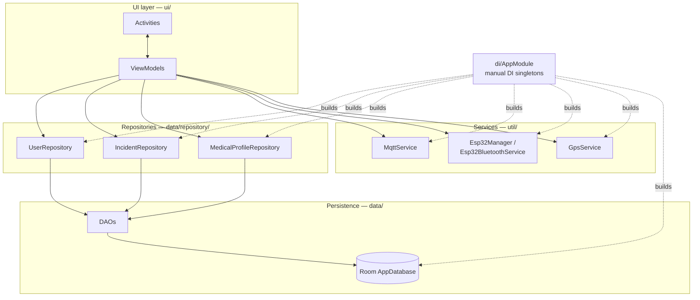
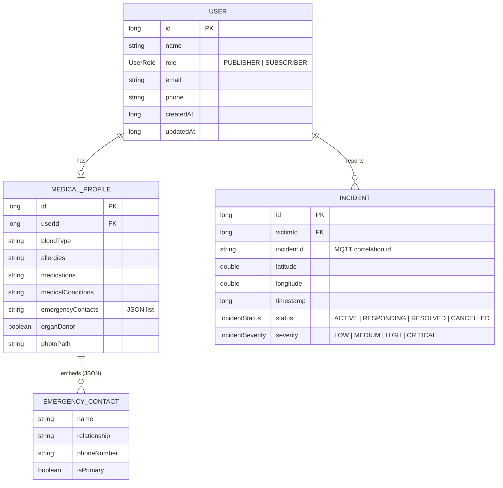
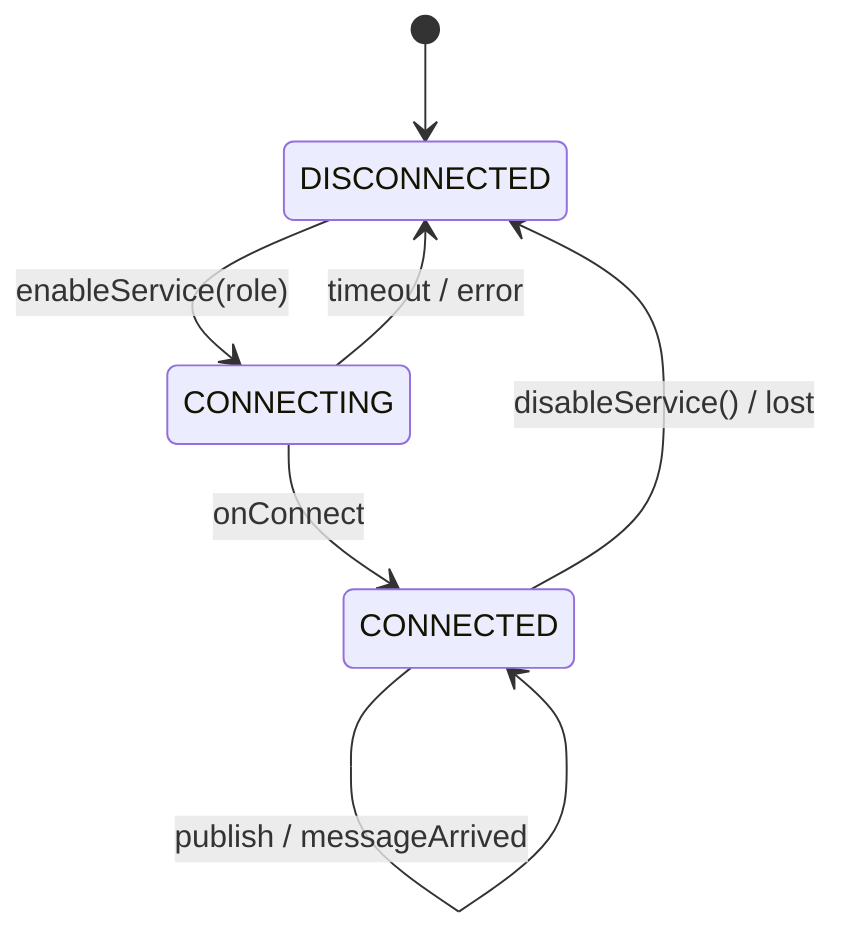
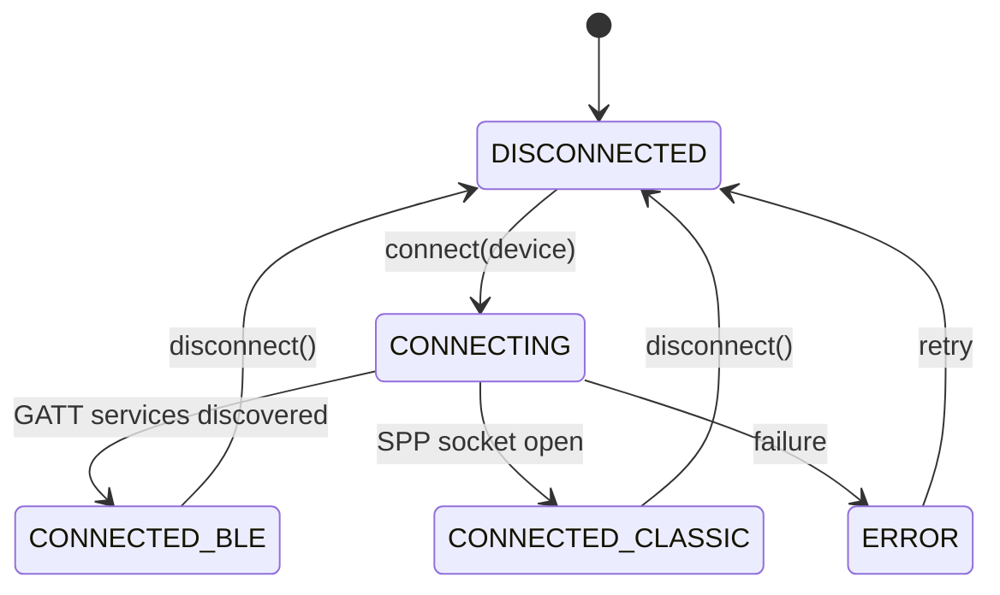

# Architecture

This document explains how the Car Crash Detection Android app is put together: its layers, its
data model, the MQTT messaging contract, and how it talks to the ESP32 sensor. Pair it with
[HARDWARE.md](HARDWARE.md) (the sensor side) and [../firmware/README.md](../firmware/README.md)
(the firmware contract).

All Kotlin lives under `app/src/main/java/com/bharath/carcrashdetection/`.

---

## 1. Layered overview

The app follows **MVVM** with a repository layer and a small hand-rolled dependency-injection
object. There is no Hilt/Dagger — a single `object AppModule` lazily constructs and hands out
singletons.



### Package responsibilities

| Package | Responsibility |
|---------|----------------|
| `data/model` | Room `@Entity` classes + enums (`User`, `Incident`, `MedicalProfile`, `EmergencyContact`) |
| `data/dao` | Room DAOs returning `Flow` for reactive reads |
| `data/database` | `AppDatabase` (singleton, double-checked locking) |
| `data/repository` | Coroutine/Flow APIs over the DAOs; the only thing ViewModels touch for data |
| `data/util` | `Converters` for complex column types |
| `di` | `AppModule` — lazy singletons for DB, repos, and services |
| `ui/base` | `BaseActivity`, `BaseFragment`, `BaseViewModel` (view binding, logging, error helpers) |
| `ui/main` | Role selection + navigation |
| `ui/publisher` | Victim mode + medical-profile editor |
| `ui/subscriber` | Responder mode + incident detail + alert history |
| `ui/settings` | MQTT broker configuration screen |
| `ui/testing` | `BluetoothTestActivity`, `MqttTestActivity` bring-up tools |
| `util` | Cross-cutting services: MQTT, ESP32/Bluetooth, GPS, permissions, error/crash handling, logging |
| `production` | `ProductionMonitor`, `MaintenanceManager`, `InstallationManager` (scaffolding — see note below) |
| `demo` | `DemoScenarioManager` (scaffolding for presentations) |
| `testing` | `IntegrationTestSuite` (in-app self-tests; scaffolding) |

> **Scaffolding note:** the `production/`, `demo/`, and `testing/` packages provide structured
> backends (monitoring loops, scenario/step models, test-result models) but are not fully wired
> into shipping UI flows. Treat them as extension points rather than finished features.

---

## 2. Data model

Room database, version 1, `exportSchema = false`, `fallbackToDestructiveMigration()` (a schema bump
clears local data).



`EmergencyContact` is `@Serializable` and stored as a JSON string inside `MedicalProfile`
(see `data/util/Converters.kt`), rather than as its own table.

---

## 3. MQTT messaging

The messaging backbone is `util/MqttService.kt` (an Android `Service`) wrapping the Eclipse Paho
client via `util/AndroidXMqttClient.kt`. Results are surfaced to the UI through
`LocalBroadcastManager` intents.

### Connection model
- The broker is **not** hard-coded. `util/MqttConfig.kt` stores **IP + port** (and optional
  credentials) in `SharedPreferences` (`mqtt_settings`); the **MQTT Settings** screen edits them.
  Default `192.168.0.101:1883`. URL is assembled as `tcp://<ip>:<port>`.
- Connection only happens when the user **enables** the service for a role — there is deliberately
  **no auto-connect on boot**.
- Tunables (`MqttConfig`): `CONNECTION_TIMEOUT = 30s`, `KEEP_ALIVE_INTERVAL = 60s`,
  `MAX_RECONNECT_ATTEMPTS = 5`, `RECONNECT_DELAY = 5000ms`, client id `android_client_<timestamp>`.
- Offline resilience: `util/MqttMessageQueue.kt` buffers publishes made while disconnected and
  flushes them on reconnect.



### Topics (`util/MqttTopics.kt`)

| Constant / helper | Topic |
|-------------------|-------|
| `EMERGENCY_ALERTS` | `emergency/alerts` |
| `ALERT_BROADCAST` | `emergency/alerts/broadcast` |
| `alertIncident(id)` | `emergency/alerts/{id}` |
| `EMERGENCY_STATUS` / `STATUS_SYSTEM` | `emergency/status` · `emergency/status/system` |
| `EMERGENCY_RESPONSE` / `responseIncident(id)` | `emergency/response` · `emergency/response/{id}` |
| `RESPONSE_ACK` | `emergency/response/ack` |

Role-based subscription (`subscribeTopicsForRole`):
- **PUBLISHER** → `emergency/alerts/{incidentId}` (own), `emergency/status/system`, `emergency/response/broadcast`
- **SUBSCRIBER** → `emergency/alerts/broadcast`, `emergency/alerts/+`, `emergency/status/+`, `emergency/response/+`, `emergency/response/ack/+`

### Message schemas (`util/MqttMessageSchemas.kt`)

Crash alert (Publisher → broker, QoS 1):
```json
{
  "type": "emergency_alert",
  "incidentId": "INC-1718000000000",
  "victimId": "42",
  "victimName": "Jane Doe",
  "location": { "latitude": 12.971599, "longitude": 77.594566 },
  "timestamp": 1718000000000,
  "severity": "HIGH",
  "medicalInfo": {
    "bloodType": "O+",
    "allergies": ["penicillin"],
    "medications": ["insulin"],
    "conditions": ["diabetes"]
  }
}
```

Responder acknowledgement (Subscriber → broker):
```json
{
  "type": "response_ack",
  "incidentId": "INC-1718000000000",
  "responderId": "7",
  "responderName": "Unit 12",
  "status": "EN_ROUTE",
  "eta": 240,
  "timestamp": 1718000005000
}
```

### Inbound dispatch
`messageArrived()` parses the payload and rebroadcasts a typed local intent
(`EMERGENCY_ALERT_RECEIVED`, `SIMPLE_MESSAGE_RECEIVED`, `CUSTOM_MESSAGE_RECEIVED`,
`GENERAL_MESSAGE_RECEIVED`). ViewModels register receivers and update their `StateFlow`s.

---

## 4. ESP32 / Bluetooth

`util/Esp32Manager.kt` is the coordinator; `util/Esp32BluetoothService.kt` does the work
(`util/Esp32WifiDirectService.kt` is a partial fallback). BLE is the supported path.

### Contract (must match the firmware)
| Item | Value |
|------|-------|
| Device name | `ESP32_CarCrash` |
| BLE service UUID | `4fafc201-1fb5-459e-8fcc-c5c9c331914b` |
| BLE characteristic UUID | `beb5483e-36e1-4688-b7f5-ea07361b26a8` (READ · WRITE · NOTIFY) |
| Classic SPP UUID | `00001101-0000-1000-8000-00805f9b34fb` |
| Wire format | `ACC:<x>,<y>,<z>\|IMPACT:<force>\|GPS:<lat>,<lon>` |

The parsed payload becomes a `SensorData(accelerometerX/Y/Z, impactForce, latitude, longitude,
timestamp)` exposed as a `StateFlow<SensorData?>`. Impact thresholding/severity is applied
**app-side** (the firmware only measures and streams).



Device discovery uses a single `BroadcastReceiver` (`bluetoothReceiver`) registered with
`RECEIVER_NOT_EXPORTED` on API 33+ (required on Android 14). Discovered devices are published as a
`StateFlow<List<BluetoothDevice>>`.

---

## 5. Location

`util/GpsService.kt` wraps `LocationManager` (GPS + network providers) and exposes
`currentLocation`, `isGpsEnabled`, and `locationAccuracy` as `StateFlow`s
(`MIN_TIME = 1000ms`, `MIN_DISTANCE = 1m`). The Publisher attaches the latest fix to each alert.

---

## 6. Cross-cutting concerns

- **Concurrency:** Kotlin Coroutines for repositories/services; a cached thread pool inside the
  Bluetooth service for blocking socket work.
- **Permissions:** `util/PermissionManager.kt` centralizes runtime requests (Bluetooth scan/connect,
  fine location, camera).
- **Errors & logging:** `util/ErrorHandler.kt`, `util/CrashHandler.kt` (global uncaught-exception
  handler installed in `CarCrashDetectionApp`), and `util/LogConfig.kt`.
- **Build flags:** `BuildConfig.ENABLE_LOGGING / ENABLE_DEBUG_FEATURES / ENABLE_ANALYTICS` differ
  between debug and release (`app/build.gradle.kts`).

---

## 7. Where to look first

| If you want to understand… | Start at |
|----------------------------|----------|
| App startup & DI | `CarCrashDetectionApp.kt`, `di/AppModule.kt` |
| Publishing an alert | `ui/publisher/PublisherViewModel.kt` → `util/MqttService.kt` |
| Receiving an alert | `util/MqttService.kt` (`messageArrived`) → `ui/subscriber/SubscriberViewModel.kt` |
| Talking to the ESP32 | `util/Esp32BluetoothService.kt` |
| The data model | `data/model/*`, `data/database/AppDatabase.kt` |
