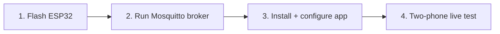

# Setup Guide

End-to-end setup for the whole system: the ESP32 sensor node, the Mosquitto MQTT broker, and the
Android app — finishing with a two-phone live test. For a no-hardware "just run the app" path, see
[QUICK_START.md](QUICK_START.md).



---

## Part 1 — ESP32 sensor node

Full wiring and firmware details are in [HARDWARE.md](HARDWARE.md) and
[../firmware/README.md](../firmware/README.md). In short:

1. Install the **ESP32 board package** (Arduino Boards Manager → "esp32" by Espressif) and the
   **MPU6050** and **TinyGPS++** libraries.
2. Wire the MPU6050 (SDA→GPIO21, SCL→GPIO22) and GPS (TX→GPIO16, RX→GPIO17); power from 3.3 V.
3. Open `firmware/car_crash_sensor/car_crash_sensor.ino`, select **ESP32 Dev Module** + your port,
   and upload.
4. Open Serial Monitor @ **115200** and confirm: `BLE Server ready - waiting for connections...`.

The node advertises as **`ESP32_CarCrash`**. (Hardware is optional — the app still runs and you can
exercise MQTT with two phones; you just won't have real sensor data.)

---

## Part 2 — Mosquitto MQTT broker

The app expects a Mosquitto broker reachable on your LAN (default `192.168.0.101:1883`). Helper
scripts live in `scripts/` — see [../scripts/README.md](../scripts/README.md).

### Install

**macOS**
```bash
brew install mosquitto
```

**Linux (Debian/Ubuntu)**
```bash
sudo apt-get install mosquitto mosquitto-clients
```

**Windows** — download from <https://mosquitto.org/download/> (or `choco install mosquitto`).

**Docker (any OS)**
```bash
docker run -d --name mosquitto -p 1883:1883 eclipse-mosquitto:latest
```

### Run it with the project config
```bash
# from the scripts/ directory
mosquitto -c mosquitto_local.conf -v        # or: ./start_mosquitto.sh  /  start_mosquitto.bat
```
The sample configs (`scripts/mosquitto_config.conf`, `scripts/mosquitto_local.conf`) listen on
**1883** and **allow anonymous connections** — convenient for a lab, but enable authentication +
TLS for anything real.

### Find your broker's IP (you'll type this into the app)
```bash
# macOS / Linux
ipconfig getifaddr en0      # macOS
hostname -I                 # Linux
# Windows
ipconfig | findstr IPv4
```

### Verify the broker
```bash
# subscribe in one terminal…
mosquitto_sub -h localhost -t test/connection -v
# …publish in another
mosquitto_pub -h localhost -t test/connection -m "hello"
```
You can also run the Python checks: `python scripts/test_local_broker.py`.

---

## Part 3 — Android app

### Build & install
```bash
git clone git@github.com:8harath/Car_Crash_Detection.git
cd Car_Crash_Detection
./gradlew assembleDebug
./gradlew installDebug
```
(or open in Android Studio and press **Run**.)

### Configure the broker — in the app, not in code
> Older notes said to edit a `BROKER_URL` constant in `MqttConfig.kt`. **That is no longer how it
> works.** The broker is configured at runtime and stored in device preferences.

1. Launch the app and pick a role.
2. Open **MQTT Settings**.
3. Enter your broker's **IP** and **port** (default `192.168.0.101` / `1883`). Input is validated.
4. Save and **enable** the MQTT service. No rebuild needed.

### Grant permissions
On first run, grant **Bluetooth (scan/connect)**, **Location** (required for BLE scanning), and
**Camera** (only if you add a medical-profile photo).

---

## Part 4 — Two-phone live test

1. Ensure Mosquitto is running and both phones are on the **same network** as the broker.
2. **Phone A → Publisher:** pick "Crash Victim", set the broker IP, enable MQTT.
3. **Phone B → Subscriber:** pick "Emergency Responder", set the same broker IP, enable MQTT.
4. On **Phone A**, trigger an emergency alert.
5. **Phone B** should receive it in the alert list; open it to see location + medical info.
6. From **Phone B**, send a response/ETA — **Phone A** should show the acknowledgement.

### With the ESP32 in the loop
1. Power the node and confirm `ESP32_CarCrash` is advertising.
2. On the Publisher, open **Bluetooth Test**, scan, and connect.
3. Watch live `ACC|IMPACT|GPS` values; a strong impact crosses the threshold and drives an alert.

---

## Setup checklist

- [ ] ESP32 flashed; Serial shows "BLE Server ready"
- [ ] `ESP32_CarCrash` visible in a BLE scanner
- [ ] Mosquitto running on port 1883
- [ ] Broker IP entered in the app's **MQTT Settings** (both phones)
- [ ] All permissions granted
- [ ] Publisher alert is received by the Subscriber
- [ ] Subscriber acknowledgement is received by the Publisher

Stuck? See [TROUBLESHOOTING.md](TROUBLESHOOTING.md).
